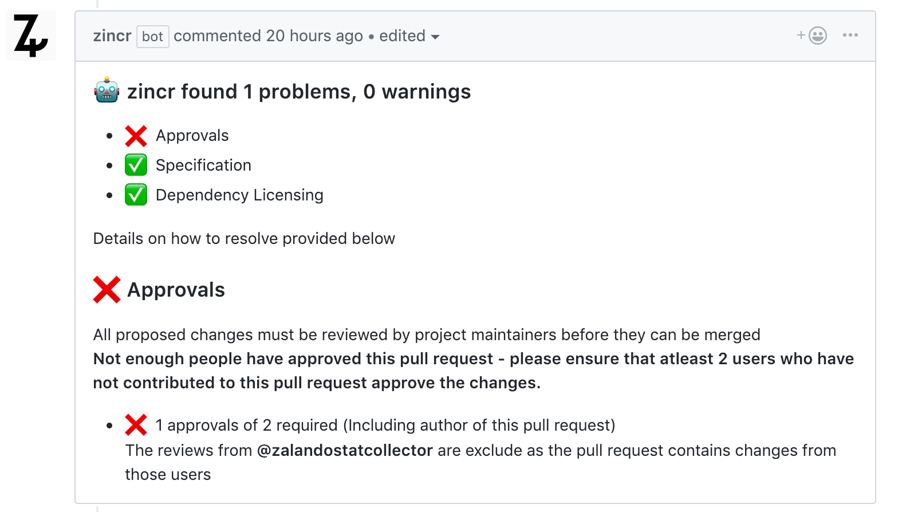
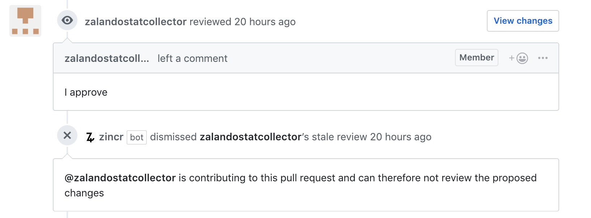

# Zincr

A GitHub App built with [Probot](https://github.com/probot/probot) to scan pull requests for specification, licensing and approvals. 

> Galvanization or galvanizing is the process of applying a protective **zinc** coating to steel or iron, to prevent rusting. The most common method is hot-dip galvanizing, in which the parts are submerged in a bath of molten zinc.

The app will leave a comment on each pull request with instructions on how resolve the issue, and also provide a full list of checks performed in a status check - if any checks fails, it will block the merge.



## Install on Github
Install via [Github Apps](https://github.com/apps/zincr) out of the box, the bot will run pre-configured checks on all pull requests:

- [Specification](#Specification)
- [Approvals](#Approvals)
- [License](#License)
- [Large Commits](#Large-Commits)

The checks will rerun on new PRs, PR updates and when PRs are reviewed. Details on each check is outlined further down.

## Configuration
You can modify the default behavior by adding a `/.zappr.yml` or `/.github/zincr.yml` file - each task has a configuration section which corresponds to its name, if the check is not specified in the config, it will not run. 

Sample config:

```yaml
approvals:
  includeAuthor: true
  minimum: 2
  enabled: true

license:
  enabled: true
  onlyAllow: 
    - MIT
    - ISC
    - MPL-2.0

specification:
  enabled: false
```

## Available Checks

### Approvals
Checks if a minimum number of team members have approved a proposed change in a pull request. The checks counts the number of reviews approving the change and have the option to include the author in the final count of reviews - if the author is a member of the current organisation where the repository exists. 

This check is somewhat stricter than standard GitHub reviews as it will **dismiss all reviews by team members who have contributed to the pull request**. 

**Example**: User A submits a PR, User B has access to the branch and makes changes to this branch directly. Normally GitHub reviews will allow User B to approve the PR and thereby allow changes without review to enter the master branch. This check will dismiss any approvals by users who also have commits in the PR branch - except for changes made via the suggestion feature, as these are approved by the original author before inclusion. 



#### Config options:
```yaml
approvals:
  // true by default, if the author is a member of the org it counts towards the total count of approvals
  includeAuthor: true
  
  // Number of people who must reviee and approved [default is 2]
  minimum: 2
  enabled: true
 ```

### License
Checks the license of dependencies i npm, pip, sbt and gradle license files (uses [License-Lookup](https://github.com/perploug/license-lookup) - if a pull request includes new dependencies, this check will warn the maintainers to review the dependency, if the dependency licensing can be detected it will determine if the license is either compatible with the allowed or exclude licenses or the base license of the repository.

#### Config options:
```yaml
license:
  enabled: true
  
  // Either determine compliance based on a base license (Use SPDX identifier):
  baseLicense: MIT
  
  // ...Or use specific allow/exclude lists (Use SPDX identifiers)
  onlyAllow: 
    - MIT
    - ISC
    - MPL-2.0
    
  exclude:
    - AGPL-3.0
 ```

`exclude` and `onlyAllow` have overloads to use a pre-set list of licenses of a specific type instead of SPDX IDs, 
these are: `publicdomain`,`permissive`, `weakcopyleft`, `strongcopyleft` and `networkcopyleft` 


### Specification
Check to determine if the specification of a pull request follows specific style rules, it must have a minimum length, include a url, and include an issue ID, each individual check can be enabled/disabled

```yaml
specification: 
  enabled: true
  title: 
    minimum-length:
      length: 8
      enabled: true
  body:
    minimum-length:
      length: 8
      enabled: true
    // Enforce that all PRs have a url  
    contains-url: false,
    
    // Enforce that all PRs have a github issues ID (#1234)
    contains-issue-number: true
```

### Large Commits
Check to detect big changes made to a file in a single commit to warn of potential large changes which can have a higher degree of complexity and have a bigger risk of being an external code snippet pasted into the codebase and therefore need to be reviewed carefully for copyright and licensing issues.

```yaml
largecommits: 
  enabled: true
  maxLines: 100
```

## Setup

```sh
# Install dependencies
npm install

# Run typescript
npm run build

# Run the bot
npm start
```

## Contributing

If you have suggestions for how Zincr could be improved, or want to report a bug, open an issue! We'd love all and any contributions.

For more, check out the [Contributing Guide](CONTRIBUTING.md).

## License

[MIT](LICENSE) © 2018 Zalando SE, Author: Per Ploug <per.ploug@zalando.de>
